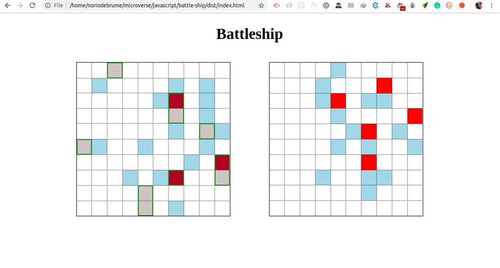

# battle-ship

This is a battleship game project built by [Raphael Noriode](https://github.com/Oghenebrume50) and [Philip Yirenkiyi](https://github.com/pwilson77)

## Technology Used
- HTML5
- CSS
- Javascript

### How to Play 
Click on the Play button on page load and randomly click on boxes to select a ship position repeat this till a winner is found.

## proper reference 
[Battleship](https://en.wikipedia.org/wiki/Battleship_(game))